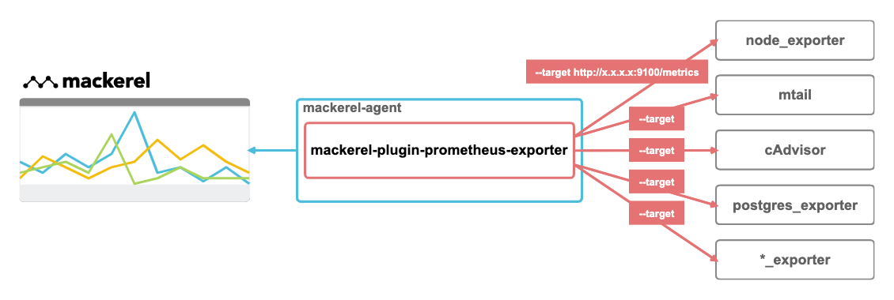

# mackerel-plugin-prometheus-exporter [](https://github.com/k1LoW/mackerel-plugin-prometheus-exporter/actions) [](https://github.com/k1LoW/mackerel-plugin-prometheus-exporter/releases)

Mackerel plugin for reading Prometheus exporter metrics.



## Usage

``` console
$ mackerel-plugin-prometheus-exporter -h
Mackerel plugin for reading Prometheus exporter metrics.

Usage:
  mackerel-plugin-prometheus-exporter [flags]

Flags:
  -h, --help                  help for mackerel-plugin-prometheus-exporter
  -p, --prefix string         Metric key prefix (default "prome")
  -t, --target stringArray    Prometheus exporter endpoint
      --tempfile string       Temp file name
```

## Example

``` toml
[plugin.metrics.prometheus-exporter]
command = "mackerel-plugin-prometheus-exporter --target=http://:9100/metrics --target=http://:9197/metrics"
exclude_pattern = "^go_"
```

``` console
$ mackerel-plugin-prometheus-exporter --target=http://:9100/metrics --target=http://:9197/metrics # scrape exporters
[...]
prome.node_filesystem_size_bytes.node_filesystem_size_bytes-device_dev_disk1s1_fstype_apfs_mountpoint	499963174912	1576905934
prome.node_filesystem_size_bytes.node_filesystem_size_bytes-device_dev_disk1s4_fstype_apfs_mountpoint_private_var_vm	499963174912	1576905934
prome.node_filesystem_size_bytes.node_filesystem_size_bytes-device_map_-hosts_fstype_autofs_mountpoint_net	0	1576905934
prome.node_filesystem_size_bytes.node_filesystem_size_bytes-device_map_auto_home_fstype_autofs_mountpoint_home	0	1576905934
prome.node_memory_active_bytes.node_memory_active_bytes	5334126592	1576905934
prome.node_memory_swapped_in_bytes_total.node_memory_swapped_in_bytes_total	35949211648	1576905934
prome.node_memory_swapped_out_bytes_total.node_memory_swapped_out_bytes_total	1978159104	1576905934
prome.node_cpu_seconds_total.node_cpu_seconds_total-cpu_0_mode_idle	64687.540000	1576905934
prome.node_cpu_seconds_total.node_cpu_seconds_total-cpu_0_mode_nice	0	1576905934
prome.node_cpu_seconds_total.node_cpu_seconds_total-cpu_0_mode_system	15166.140000	1576905934
prome.node_cpu_seconds_total.node_cpu_seconds_total-cpu_0_mode_user	8698.860000	1576905934
[...]
prome.node_network_transmit_bytes_total.node_network_transmit_bytes_total-device_en0	590879744	1576905934
prome.node_network_transmit_bytes_total.node_network_transmit_bytes_total-device_en1	0	1576905934
prome.node_network_transmit_bytes_total.node_network_transmit_bytes_total-device_en2	0	1576905934
prome.node_network_transmit_bytes_total.node_network_transmit_bytes_total-device_gif0	0	1576905934
prome.node_network_transmit_bytes_total.node_network_transmit_bytes_total-device_lo0	178785280	1576905934
prome.node_network_transmit_bytes_total.node_network_transmit_bytes_total-device_p2p0	0	1576905934
prome.node_network_transmit_bytes_total.node_network_transmit_bytes_total-device_stf0	0	1576905934
prome.node_network_transmit_bytes_total.node_network_transmit_bytes_total-device_utun0	0	1576905934
prome.node_network_transmit_bytes_total.node_network_transmit_bytes_total-device_utun1	8192	1576905934
prome.node_time_seconds.node_time_seconds	1576905934.440095	1576905934
[...]
prome.node_textfile_scrape_error.node_textfile_scrape_error	0	1576905934
prome.node_load1.node_load1	1.576172	1576905934
prome.node_load15.node_load15	1.877441	1576905934
prome.node_memory_compressed_bytes.node_memory_compressed_bytes	1154330624	1576905934
prome.node_memory_wired_bytes.node_memory_wired_bytes	2934050816	1576905934
```

## TODO

- [ ] Support config.yml ( `-c, --config` )
- [ ] `--target` endpoint query string ( like `--target=http://:9100/metrics?role=app&hostname=app-1.internal`) to label
- [ ] Default http.Client setting
- [ ] Service discovery
- [ ] Auto update metrics graph definition

## Alternatives

- [mackerel-plugin-prometheus-query](https://github.com/fujiwara/mackerel-plugin-prometheus-query): Prometheus query plugin for Mackerel.
